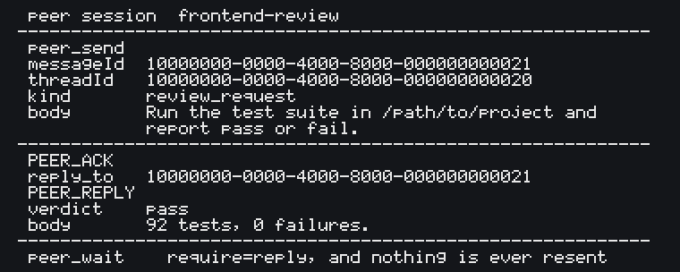

# A sanitized round trip

One message, one ACK, one reply. Every value below comes from `fixtures/demo-ack/session.json` in
the repository. `test/demo-ack.test.mjs` drives the real sender, feeds the two markers back
through the real receive path, and checks every JSON example on this page against the published
tool schema, so this page cannot drift away from what the software actually does.

The same round trip as a picture is [round-trip.png](round-trip.png). It was never on a screen:
it is drawn from the same fixture, so the menu bar, account name, window title, other session
names and home path a real capture carries were never in it. A test reads the text back out of
its pixels, redraws that text and compares every pixel, and checks that the file carries no
metadata chunk at all. Everything below is the same round trip in a form you can diff line by
line. See [../CONTRIBUTING.md](../CONTRIBUTING.md) for the rules both of them follow.



## 1. The client calls `peer_send`

```json
{
  "alias": "frontend-review",
  "messageId": "10000000-0000-4000-8000-000000000021",
  "threadId": "10000000-0000-4000-8000-000000000020",
  "kind": "review_request",
  "body": "Run the test suite in /path/to/project and report pass or fail."
}
```

`messageId` is yours and it is the idempotency key. Sending the same `messageId` with the same
content returns the first result instead of delivering a second message to a human.

## 2. What the target session receives

Your five arguments are first written as one canonical JSON line — that exact line is what the
`requestHash` is taken over — and then wrapped once by `senderEnvelope`
(`src/adapters/claude-native-v1/protocol.mjs`). The target session sees this, and nothing else:

```text
<cross-session-message from="uds:/path/to/state/universal-peer-mcp.sock" from-name="universal-peer-mcp">
{"alias":"frontend-review","messageId":"10000000-0000-4000-8000-000000000021","threadId":"10000000-0000-4000-8000-000000000020","replyTo":null,"kind":"review_request","body":"Run the test suite in /path/to/project and report pass or fail."}
</cross-session-message>
```

Two things to read there. `replyTo` is present as `null` even though step 1 never sent it: the
canonical form always carries all six keys, so the same message always hashes the same way. And
`body` is the string you sent, quoted inside that line — the wrapper does not paraphrase it.

`from` is your own daemon's private socket path on a real machine; the placeholder here is the
sanitized stand-in. There is no `from-mode`, and its absence is the message: the daemon
authenticates the process that connected to it, not the Claude session behind that process, so
this package cannot prove what the sender is allowed to do and does not say. What that costs the
receiver is written down in [known-issues.md](known-issues.md) §10.

`body` is copied in with one substitution, the same one Claude Code's own sender makes: a closing
`</cross-session-message>` inside a body is written `<\/cross-session-message>` so that a body
cannot end the envelope that carries it. Nothing else about the body is rewritten — `<` in code
stays `<`, and the substitution is invisible through `JSON.parse`, which reads `\/` as `/`.

If you are on the receiving side, read `body` out of that JSON line and answer with a marker as
shown next. The marker goes in your reply message, not inside the JSON.

## 3. The target answers with an ACK

The marker must be the **first line** of the reply message. Anything after it is free text.

```text
PEER_ACK v=1 message_id=10000000-0000-4000-8000-000000000023 thread_id=10000000-0000-4000-8000-000000000020 reply_to=10000000-0000-4000-8000-000000000021
```

`reply_to` carries the `messageId` from step 1 unchanged. That is how the pair is matched.
A `PEER_ACK` carrying `verdict=` is not accepted as a marker.

## 4. The target finishes and replies

```text
PEER_REPLY v=1 message_id=10000000-0000-4000-8000-000000000024 thread_id=10000000-0000-4000-8000-000000000020 reply_to=10000000-0000-4000-8000-000000000021 verdict=pass
92 tests, 0 failures.
```

`PEER_REPLY` requires `verdict=pass` or `verdict=fail`. Without it the line is not a marker and
`peer_wait` keeps waiting.

## 5. The caller's `peer_wait`

```json
{
  "messageId": "10000000-0000-4000-8000-000000000021",
  "require": "reply",
  "timeoutMs": 30000
}
```

`peer_wait` takes no `alias`. The `messageId` is enough, because it is the key the local event
log is correlated by, and passing anything else is rejected as invalid parameters.

The wait returns when the marker for that exact `messageId` arrives. `timedOut: true` is not a
failure and not a reason to send again; nothing is ever resent for you.

## What is deliberately absent

- No session UUID from a real machine. Every identifier here is in the `10000000-0000-4000-8000-*`
  fixture band, and a test fails the build if any other UUID appears in the repository.
- No home directory. Paths are `/path/to/project` and `/path/to/state`.
- No token, no socket path, no process id, no display name from a real session.
- No captured screen. The one picture is drawn from the fixture, its text is read back out of
  its pixels and scanned like any other file, and it carries no metadata chunk to strip.

See [../CONTRIBUTING.md](../CONTRIBUTING.md) for the rules this page follows, and
[threads-launch-ko.md](threads-launch-ko.md) for the Korean walkthrough of the same flow.
